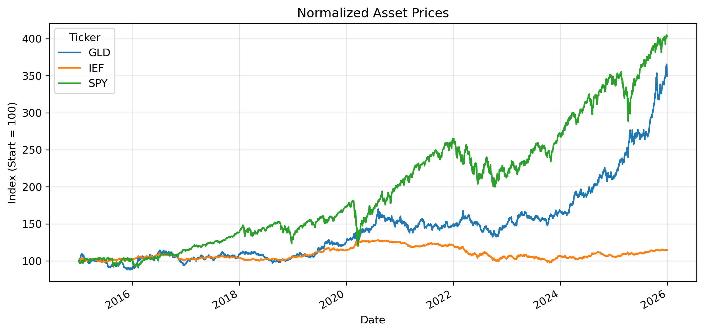
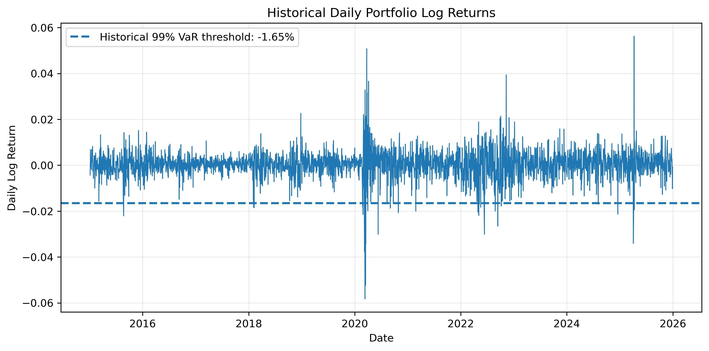
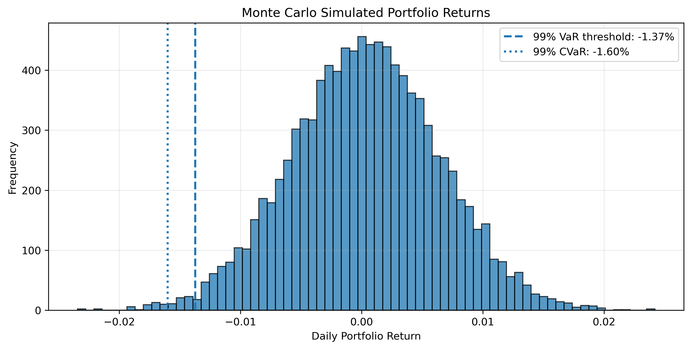

# Monte Carlo Portfolio Stress Test

This project applies a Monte Carlo simulation to evaluate downside risk in a multi-asset portfolio.

## Portfolio

- SPY — Equities: 50%
- IEF — Bonds: 30%
- GLD — Gold: 20%

## Methods

- Log return calculation
- Portfolio aggregation
- Historical VaR
- Historical CVaR
- Monte Carlo simulation
- 99% stress-loss estimation

## Tools

- Python
- yfinance
- pandas
- numpy
- matplotlib

## Visualizations

